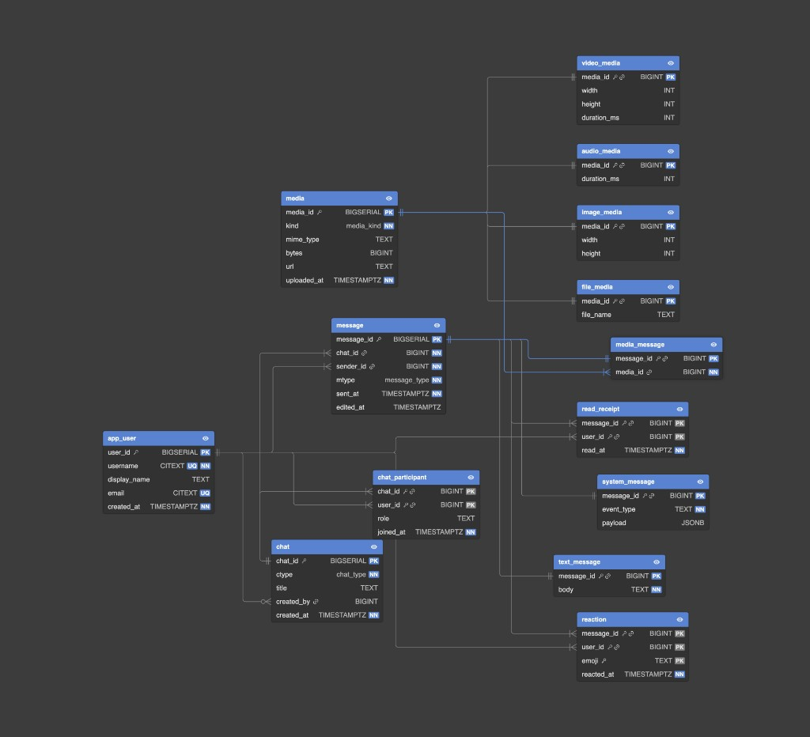

# SQL Chat App Example

A fully-modeled chat application database schema with working clients for **Web** and **iOS**, plus a standalone **backend** SQL reference. Every layer speaks the same relational model — the only difference is the dialect (PostgreSQL vs SQLite).



---

## Repository structure

```
.
├── backend/            # PostgreSQL reference (pure SQL)
│   ├── schema.sql      # DDL – tables, types, indexes
│   ├── seed.sql        # Sample data
│   └── queries.sql     # Common query patterns
│
├── web/                # Browser client (pure SQL via sql.js / WASM)
│   └── index.html      # Single-file chat UI – open in any browser
│
├── ios/                # Xcode project (SwiftUI + SQLite)
│   ├── sql-chat-app-example/
│   │   ├── Database/
│   │   │   ├── schema.sql          # SQLite DDL
│   │   │   └── ChatDatabase.swift  # Thin SQLite3 wrapper
│   │   ├── Models/
│   │   │   └── ChatModels.swift
│   │   └── Views/
│   │       ├── ChatListView.swift
│   │       └── ChatDetailView.swift
│   └── sql-chat-app-example.xcodeproj/
│
└── docs/
    └── erd.png         # Schema diagram
```

---

## Schema overview

| Table | Purpose |
|---|---|
| `app_user` | Registered users (username, display name, email) |
| `chat` | Conversation container — direct, group, or channel |
| `chat_participant` | Many-to-many link between users and chats |
| `message` | Base message row with type discriminator (`text`, `media`, `system`) |
| `text_message` | Body text for text messages |
| `system_message` | Event type + JSON payload for system events |
| `media` | Uploaded file metadata (kind, mime, size, URL) |
| `media_message` | Links a message to its media |
| `image_media` | Width / height for images |
| `video_media` | Width / height / duration for videos |
| `audio_media` | Duration for audio clips |
| `file_media` | Original filename for generic files |
| `reaction` | Emoji reactions on messages |
| `read_receipt` | Per-user read tracking |

Custom enum types (PostgreSQL): `chat_type`, `message_type`, `media_kind`
SQLite uses `CHECK` constraints to achieve the same validation.

---

## Quick start

### Web (no server required)

```bash
open web/index.html
# or just double-click the file
```

The page loads **sql.js** (SQLite compiled to WebAssembly), creates all tables in-memory, seeds sample data, and renders a chat UI. There is a built-in **SQL Console** at the bottom to run arbitrary queries against the live database.

### iOS

1. Open `ios/sql-chat-app-example.xcodeproj` in Xcode 15+.
2. Build & run on a simulator or device (iOS 17+).
3. The app creates a local SQLite database on first launch with the same seed data.

> **Note:** Add `schema.sql` to the Xcode target's **Copy Bundle Resources** build phase if it is not already included.

**Unit tests from the terminal** (pick a simulator that exists on your Mac; iPhone 17 is the default assumed here for Xcode 26 / iOS 26 runtimes):

```bash
cd ios
xcodebuild test -scheme sql-chat-app-example \
  -destination 'platform=iOS Simulator,name=iPhone 17' \
  -only-testing:sql-chat-app-exampleTests
```

To see exact device strings: `xcrun simctl list devices available`.

### Backend (PostgreSQL)

```bash
# Create a database
createdb chatapp

# Apply schema + seed data
psql chatapp -f backend/schema.sql
psql chatapp -f backend/seed.sql

# Try out queries
psql chatapp -f backend/queries.sql
```

---

## DataGrip project setup (for backend representation)

You can create a JetBrains DataGrip project that gives your partner a rich IDE experience for exploring the schema:

1. **Open DataGrip** and create a new project (`File → New Project`). Name it `sql-chat-app`.
2. **Add a data source:**
   - Click `+` in the Database tool window → `Data Source → PostgreSQL`.
   - Point it at the `chatapp` database (or any PostgreSQL instance where you ran `schema.sql`).
   - Test the connection.
3. **Attach the SQL files:**
   - Drag-and-drop (or `File → Open`) the `backend/` folder into the project Files panel.
   - DataGrip will syntax-highlight and resolve all table/column references.
4. **Create a run configuration** (optional):
   - Right-click `schema.sql` → `Run` to execute DDL directly.
   - Do the same for `seed.sql` and `queries.sql`.
5. **Export the project** for your partner:
   - The project lives in `~/DataGripProjects/sql-chat-app/` (or wherever you chose).
   - Zip that folder and share it — your partner opens it via `File → Open`.
   - The `.idea/` directory inside contains all DataGrip project settings.

> **Tip:** If you want the DataGrip project *inside* this repo, create it at `backend/.idea/` by opening the `backend/` folder as the DataGrip project root. Then commit the `.idea/dataSources.xml` and `.idea/sqldialects.xml` files (exclude `dataSources.local.xml` which contains credentials).

---

## UI design

Both the web and iOS clients share the same visual language:

- **Dark theme** — deep navy background with accent blue (#4361EE)
- **Sidebar / list** on the left showing chats with avatar initials, last message preview, and timestamp
- **Chat panel** on the right with grouped message bubbles
- **Blue outgoing bubbles** (bottom-right radius flattened) and **dark incoming bubbles** (bottom-left radius flattened)
- Emoji reactions shown as chips below messages
- System messages centered and muted

---

## License

MIT
